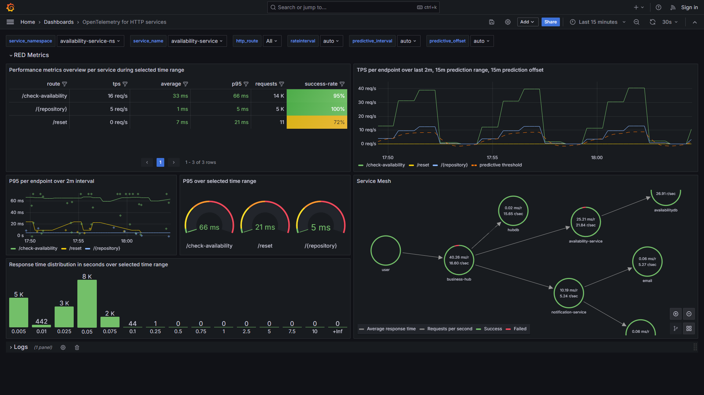
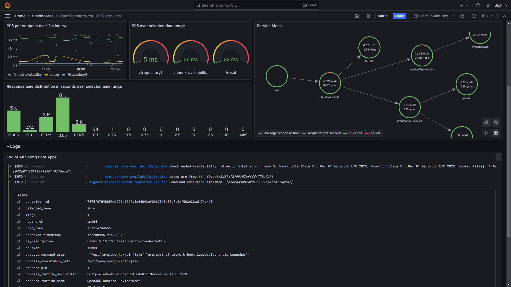
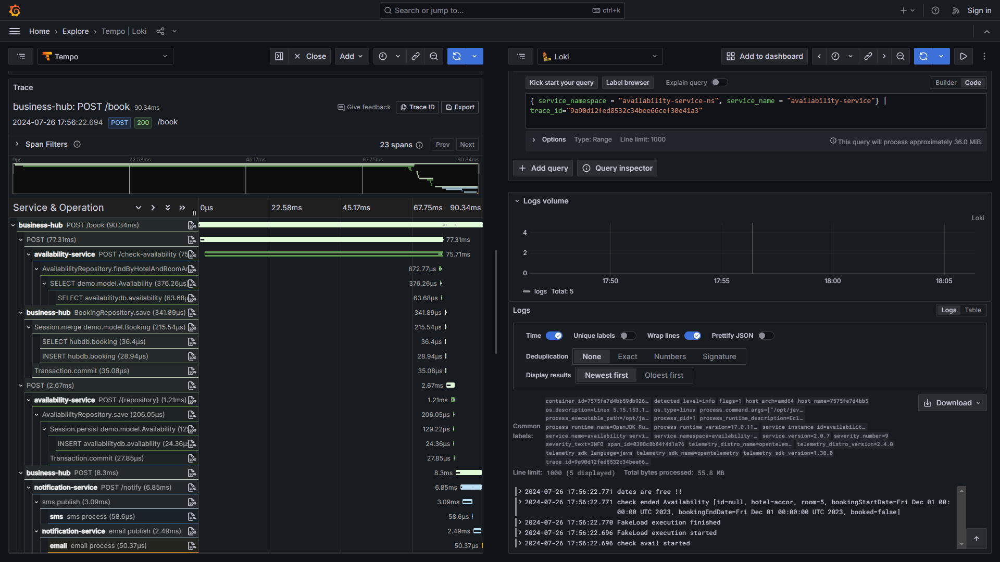

# 🚀 Applate 🚀

- [🚀 Applate 🚀](#-applate-)
  - [Installation](#installation)
  - [Commands to bootstrap projects](#commands-to-bootstrap-projects)
  - [Observability Stack for Dev Environment](#observability-stack-for-dev-environment)
    - [Grafana Dashboard for HTTP services](#grafana-dashboard-for-http-services)
    - [Grafana Dashboard For Apache Camel](#grafana-dashboard-for-apache-camel)

A set of application templates that includes observability to just start code and be ready to deploy in production and be monitored.
* Monitoring Open Telemetry
* HTTP Rest with OpenAPI / SwaggerUI
* Websockets

It also contains comprehensive Grafana Dashboard for performance monitoring on metrics logs traces profiles collected through Prometheus, Loki, Tempo, Pyroscope.

## Installation

```
cd helper/scripts ; sudo ./install.sh ; cd -
```

Oneliner
```
curl -L tinyurl.com/applate | sh
```

## Commands to bootstrap projects

```sh
# Java Spring boot
jspring

# Java Plain
jplain

# Java Sprint Boot Camel
jcamelspring

# Java Quarkus Camel
jcamelquarkus

# NodeJS Express
njsexpress YOUR_PROJECT_NAME
```

## Observability Stack for Dev Environment

Run all in one LGTM stack

```sh
docker run --name lgtm -d -p 3000:3000 \
  -p 4317:4317 \
  -p 4318:4318 \
  -p 9090:9090 \
  -p 4417:4417 \
  -p 4418:4418 \
  -p 3100:3100 \
  -p 4040:4040 \
  grafana/otel-lgtm
```

### Grafana Dashboard for HTTP services

Dashboards for applications that produce mainly `http_server_.*` metrics can be found [here](observability/dashboards-for-import/app/opentelemetry-for-http-services.json)







### Grafana Dashboard For Apache Camel

The dashboard that you can import can be found [here](observability/dashboards-for-import/app/apache-camel-micrometer.json)

Videos based on the JMX exporter version (micrometer version to come) : 
Here : http://www.youtube.com/watch?v=0LDgv1nIk-Y
or here : https://odysee.com/@alainpham:8/apache-camel-monitoring-prometheus-grafana:c 

[](http://www.youtube.com/watch?v=0LDgv1nIk-Y)

